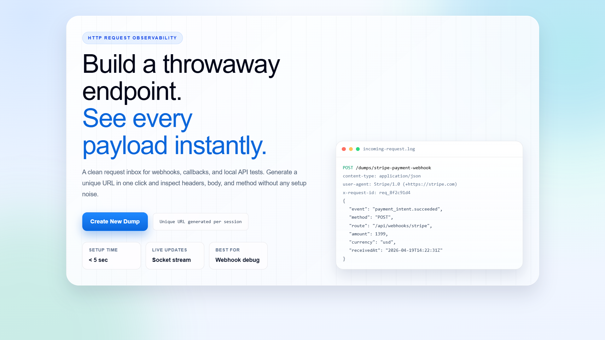
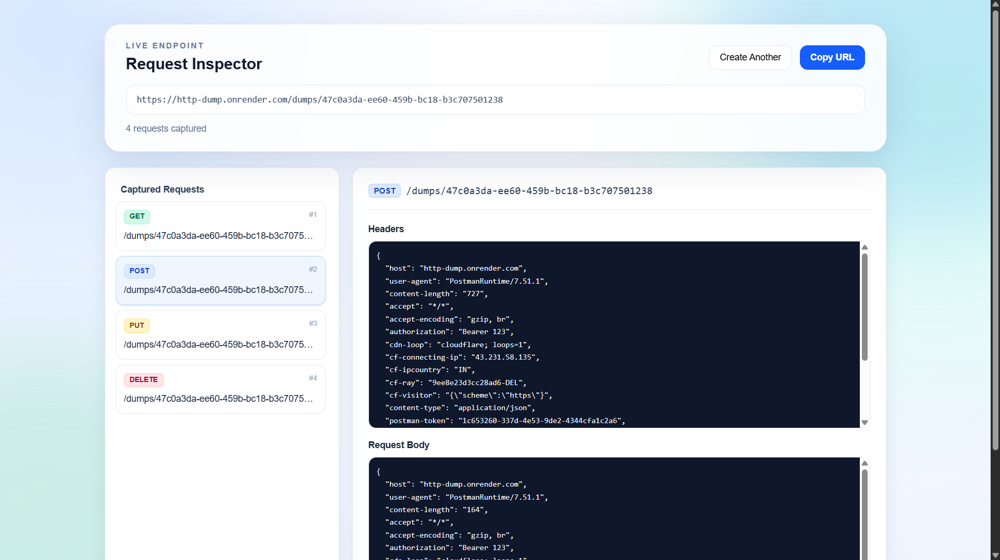

# HTTP Dump Frontend

HTTP Dump is a request inspection tool for webhook and API debugging.
Create a unique endpoint, send requests to it, and inspect headers/body in real time.

- Live app: https://http-dump.vercel.app/

## Preview

### Logo


### Home Page



### Inspect Page



## What This App Does

- Generates a unique dump session URL for quick request testing.
- Captures all incoming HTTP methods on that session endpoint.
- Displays captured requests with method, URL, headers, and body.
- Streams updates live using Socket.IO (new requests appear without manual refresh).
- Lets users copy the unique endpoint URL directly from the inspect screen.

## Tech Stack

### Frontend

- React 19
- Vite 8
- React Router
- Axios
- Socket.IO client
- Tailwind CSS 4

### Backend (used by this frontend)

- Node.js + Express
- MongoDB + Mongoose
- Socket.IO

## Routes

- `/`:
  Home screen where users create a new dump session.
- `/inspect/:dumpId`:
  Live inspector for a specific dump ID.

## How It Works

1. User clicks Create New Dump on the home page.
2. Frontend generates a UUID and routes to `/inspect/:dumpId`.
3. Frontend shows a request endpoint:
   `VITE_BACKEND_URL/dumps/:dumpId`
4. External service or local client sends requests to that endpoint.
5. Backend stores each request in MongoDB.
6. Backend emits `new_dump_created` through Socket.IO.
7. Frontend receives the event and refreshes captured request data.

## Local Development

### 1) Clone and install dependencies

Install frontend dependencies:

```bash
cd frontend
npm install
```

Install backend dependencies:

```bash
cd ../backend
npm install
```

### 2) Configure environment variables

Create `backend/.env`:

```env
PORT=3000
MONGODB_URI=mongodb://localhost:27017/http-dump
```

Create `frontend/.env`:

```env
VITE_BACKEND_URL=http://localhost:3000
```

### 3) Start backend

```bash
cd backend
npm run dev
```

### 4) Start frontend

```bash
cd frontend
npm run dev
```

Frontend default URL:

- `http://localhost:5173`

## API Reference (Backend)

- `GET /dumps/api/:dumpId`
  Returns all captured requests for a dump ID.

- `ALL /dumps/:dumpId`
  Captures incoming request method, headers, body, and URL for that dump ID.

## Quick Test Example

After generating a dump ID in the UI, send a request:

```bash
curl -X POST http://localhost:3000/dumps/<dumpId> \
	-H "Content-Type: application/json" \
	-d '{"event":"test.webhook","source":"curl"}'
```

Then open the inspect page:

```text
http://localhost:5173/inspect/<dumpId>
```

You should see the request appear in the captured requests list.

## Available Scripts (Frontend)

From `frontend`:

- `npm run dev`: Start Vite development server.
- `npm run build`: Build for production.
- `npm run preview`: Preview production build locally.
- `npm run lint`: Run ESLint.

## Deployment

- Frontend is deployed on Vercel:
  https://http-dump.vercel.app/
- Ensure `VITE_BACKEND_URL` points to your deployed backend URL.

## Use Cases

- Debug third-party webhooks (payments, auth callbacks, CI hooks).
- Inspect payloads during local API integration.
- Verify headers and request bodies quickly without writing custom logging tools.

## Notes

- This tool is intended for debugging and non-sensitive payload inspection.
- Avoid using it for confidential or regulated production data without additional security controls.
